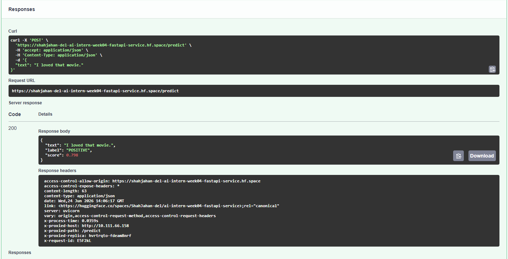

# ai-intern-week04-fastapi-service
Fourth week of the AI Engineering internship learning plan

# AI Intern Project - Week 4: FastAPI Model Deployment

This repository contains a production-ready REST API that serves a Fine-Tuned IMDb Sentiment Analysis model. The service is fully containerized using Docker and deployed on Hugging Face Spaces.

## Public Deployment
The API is globally accessible via the Swagger UI interface:
**[Public API Documentation (Swagger UI)](https://shahjahan-del-ai-intern-week04-fastapi-service.hf.space/docs)**

---

## Features & Endpoints

* **`GET /healthz`**: Liveness probe ensuring the service is running and the deep learning model is properly loaded into memory.
* **`POST /predict`**: Sentiment analysis endpoint expecting a JSON payload (`{"text": "..."}`) and returning the classification label (`POSITIVE`/`NEGATIVE`) along with its confidence score.
* **CORS Middleware**: Fully enabled to handle cross-origin requests securely.
* **Latency Logging**: Custom middleware tracking execution time down to the millisecond on every transaction.

---

## Performance Benchmark

A benchmark test was conducted directly in the cloud production environment across 10 consecutive inference requests:

* **Cold-Start Time**: `~403.9 ms` (Occurs only during the very first container invocation while setting up model weights).
* **Average Latency**: `53.3 ms`
* **Median Latency**: `50.3 ms`

The sub-60ms median latency highlights excellent performance stability and fast processing times for a CPU-bound cloud microservice.

---

## Successful API Verification

Below is a verification screenshot capturing a successful `200 OK` inference request to the `/predict` route on the live Hugging Face Space instance, displaying custom `x-process-time` tracking headers:



---

## Local Development & Execution

If you wish to clone this repository and run the service locally, make sure you have Docker installed and execute the following commands:

### 1. Run via Docker Compose
```bash
docker compose up --build